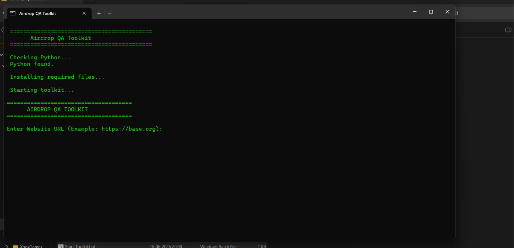
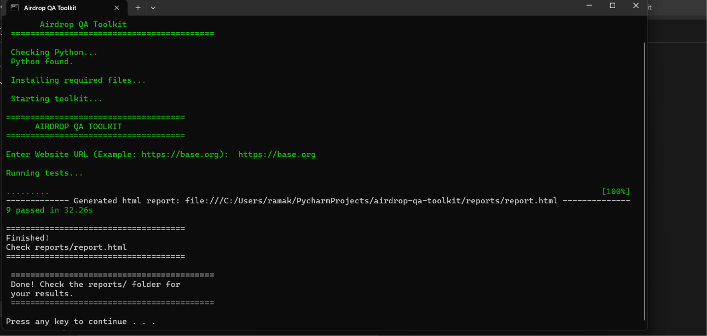
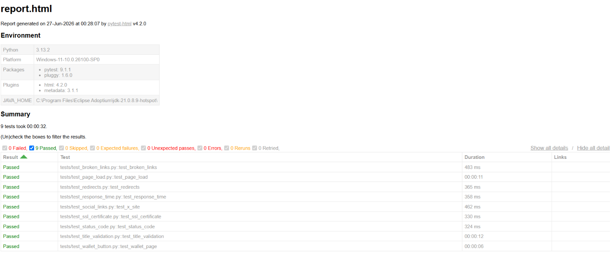
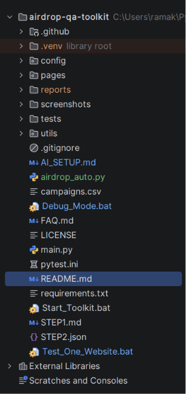

# Airdrop QA Toolkit

A simple Python toolkit to check Web3 websites before connecting your wallet.

No coding required. Install Python once, then run the toolkit.

---

## Features

* Check website availability
* Verify HTTPS/SSL certificate
* Check HTTP status code
* Detect redirects
* Measure page load speed
* Verify wallet button
* Check social links
* Generate an HTML report
* Save screenshots if a test fails

---

## Requirements

* Windows 10/11
* Python 3.10 or later
* Google Chrome
* Internet connection

---

## Setup

1. Download or clone this project.
2. Install Python from:
   https://www.python.org/downloads/
3. During installation, enable **"Add Python to PATH"**.

---

## Run

### Test one website

Double-click **run_single_site.bat**

Enter a website URL when prompted.

Example:

```
https://base.org
```

---

### Test multiple websites

Edit **campaigns.csv** with your websites.

Example:

```csv
name,url
Base,https://base.org
Bitget,https://web3.bitget.com
```

Then double-click **run.bat**.

---

## Reports

After the scan finishes, open:

```
reports/report.html
```

If a test fails, screenshots are saved in the **screenshots** folder.

---

## Need Help?

See **FAQ.md** or **AI_SETUP.md**.

---

## Screenshots

### Start Toolkit



### Test Results



### HTML Report



### Project Structure



## Coverage Declaration

Tested on: Windows

Coverage: ~100%

## License

MIT License
